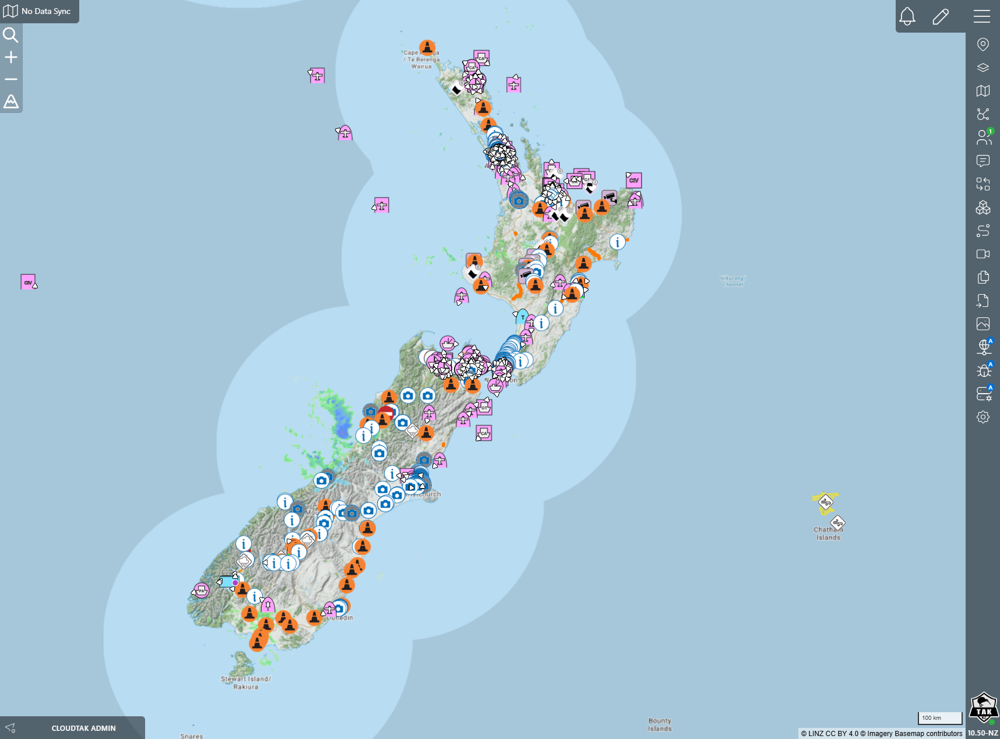

# Team Awareness Kit for New Zealand (TAK.NZ)

## Background

The [Team Awareness Kit (TAK)](https://tak.gov/solutions/emergency) provides Fire, Emergency Management, and First Responders an operationally agnostic tool for improved situational awareness and a common operational picture. 

TAK.NZ provides multiple repos to deploy TAK infrastructure on AWS. These repos are based on the work of the [Colorado Centre of Excellence for Advanced Technology Aerial Firefighting](https://github.com/dfpc-coe), the driving force behind [COTAK](https://cotak.gov/) - Colorado’s free real-time location service for emergency responders. 

### Architecture Layers

The TAK infrastructure is provided through multiple layers, each in a distinct GitHib repo. Layers can be deployed in multiple independent environments. As an example:

```
        PRODUCTION ENVIRONMENT                DEMO/TESTING ENVIRONMENT              DEVELOPMENT ENVIRONMENT
        Domain: tak.nz                        Domain: demo.tak.nz                   Domain: dev.tak.nz
        Deployed via CI/CD                    Deployed via CI/CD                    Deployed manually

┌─────────────────────────────────┐    ┌─────────────────────────────────┐    ┌─────────────────────────────────┐
│         MediaInfra              │    │         MediaInfra              │    │         MediaInfra              │
│    CloudFormation Stack         │    │    CloudFormation Stack         │    │    CloudFormation Stack         │
└─────────────────────────────────┘    └─────────────────────────────────┘    └─────────────────────────────────┘
                │                                        │                                     │
                ▼                                        ▼                                     ▼
┌─────────────────────────────────┐    ┌─────────────────────────────────┐    ┌─────────────────────────────────┐
│         CloudTAK                │    │         CloudTAK                │    │         CloudTAK                │
│    CloudFormation Stack         │    │    CloudFormation Stack         │    │    CloudFormation Stack         │
└─────────────────────────────────┘    └─────────────────────────────────┘    └─────────────────────────────────┘
                │                                        │                                     │
                ▼                                        ▼                                     ▼
┌─────────────────────────────────┐    ┌─────────────────────────────────┐    ┌─────────────────────────────────┐
│         TakInfra                │    │         TakInfra                │    │         TakInfra                │
│    CloudFormation Stack         │    │    CloudFormation Stack         │    │    CloudFormation Stack         │
└─────────────────────────────────┘    └─────────────────────────────────┘    └─────────────────────────────────┘
                │                                        │                                     │
                ▼                                        ▼                                     ▼
┌─────────────────────────────────┐    ┌─────────────────────────────────┐    ┌─────────────────────────────────┐
│        AuthInfra                │    │        AuthInfra                │    │        AuthInfra                │
│    CloudFormation Stack         │    │    CloudFormation Stack         │    │    CloudFormation Stack         │
└─────────────────────────────────┘    └─────────────────────────────────┘    └─────────────────────────────────┘
                │                                        │                                     │
                ▼                                        ▼                                     ▼
┌─────────────────────────────────┐    ┌─────────────────────────────────┐    ┌─────────────────────────────────┐
│        BaseInfra                │    │        BaseInfra                │    │        BaseInfra                │
│    CloudFormation Stack         │    │    CloudFormation Stack         │    │    CloudFormation Stack         │
└─────────────────────────────────┘    └─────────────────────────────────┘    └─────────────────────────────────┘
```

| Layer | Description | Availability | CI/CD pipeline |
|-------|-------------|--------------|----------------|
| [**BaseInfra**](https://github.com/TAK-NZ/base-infra)  | Foundation: VPC, ECS, S3, KMS, ACM | ✅ Available as CDK project | [](https://github.com/TAK-NZ/base-infra/actions/workflows/demo-deploy.yml) [](https://github.com/TAK-NZ/base-infra/actions/workflows/production-deploy.yml) |
| [**AuthInfra**](https://github.com/TAK-NZ/auth-infra) | SSO via Authentik, LDAP | ✅ Available as CDK project | [](https://github.com/TAK-NZ/auth-infra/actions/workflows/demo-deploy.yml) [](https://github.com/TAK-NZ/auth-infra/actions/workflows/production-deploy.yml) |
| [**TAKInfra**](https://github.com/TAK-NZ/tak-infra) | TAK Server | ✅ Available as CDK project | [](https://github.com/TAK-NZ/tak-infra/actions/workflows/demo-deploy.yml) [](https://github.com/TAK-NZ/tak-infra/actions/workflows/production-deploy.yml) |
| [**CloudTAK**](https://github.com/TAK-NZ/CloudTAK) | CloudTAK web interface, ETL | ✅ Available as CDK project | [](https://github.com/TAK-NZ/CloudTAK/actions/workflows/demo-deploy.yml) [](https://github.com/TAK-NZ/CloudTAK/actions/workflows/production-deploy.yml) |
| [**MediaInfra**](https://github.com/TAK-NZ/media-infra) | Media Streaming | 🚧 CDK project in progress | |

**Deployment Order**: BaseInfra must be deployed first, followed by AuthInfra, TakInfra, CloudTAK, and finally MediaInfra. Each layer imports outputs from layers below via CloudFormation exports.

Each stacks is provided in a `Prod` type with full resiliency built-in and a `Dev-Test` type with reduced resiliency for optimized cost. 

### Try this yourself

Deploy the TAK.NZ stack (Team Awareness Kit) on AWS in ~1 hour with our [One-line installer](https://github.com/TAK-NZ/tak-deploy).

### Examples

TAK.NZ CloudTAK web based TAK client interface. Various real-time data imported with CloudTAK Extract/Transform/Load (ETL) functions are displayed. 



### Estimated Cost Breakdown (BaseInfra + AuthInfra + TakInfra)
Estimated for ap-southeast-2 in USD.

#### Development Environment (~$265/month)
- **BaseInfra**: ~$44/month (VPC, ECS cluster, S3, KMS, ACM)
- **AuthInfra**: ~$85/month (Authentik, LDAP, Aurora, Redis)
- **TakInfra**: ~$91/month (TAK Server, Aurora, EFS)
- **CloudTAK**: ~$45/month (CloudTAK server, Aurora, Lambda, API Gateway)

#### Production Environment (~$958/month)
- **BaseInfra**: ~$143/month (VPC, ECS cluster, S3, KMS, ACM, VPC endpoints)
- **AuthInfra**: ~$245/month (Authentik HA, LDAP, Aurora Multi-AZ, Redis cluster)
- **TakInfra**: ~$390/month (TAK Server HA, Aurora Multi-AZ, enhanced monitoring)
- **CloudTAK**: ~$180/month (CloudTAK server, Aurora Multi-AZ, Lambda, API Gateway, enhanced monitoring)
